# OnlineSchoolProject
<h1>MrGanK Online School Project</h1>

Bu projede öğretmen bir sınıfta ders oluşturuyor ve öğrenci derslere baktığında sınıfında ders olup olmadığını görüyor. Proje bize verilirken Ders Silme yapılacak denmediği için ders silme yapmadım

 
<h2> Kullanılan Kütüphaneler</h2>

Bu projede Node.js ile Express.js, JsonWebToken, BodyParser, Dotenv Kullanılmıştır

  
<h2>Öğrenci Register</h2>
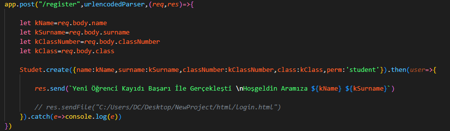
<h2>Öğrenci DataBase</h2>
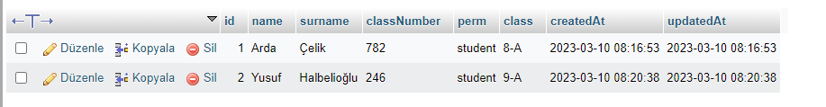
 
<h2>Öğrenci Login</h2>
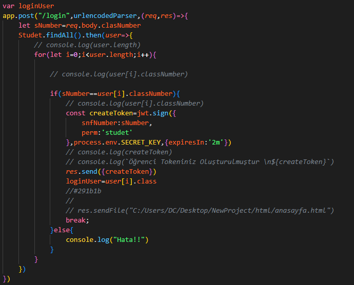
<h2>Öğrenci JsonWebToken</h2>
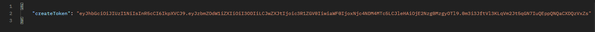
 

<h2>Öğretmen Register</h2>
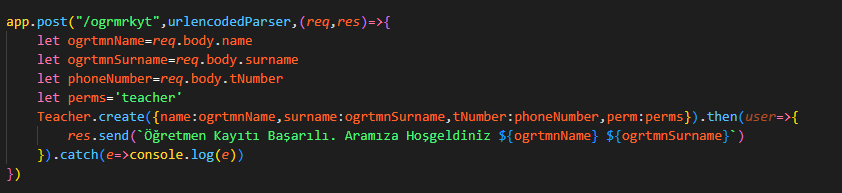
<h2>Öğretmen DataBase</h2>
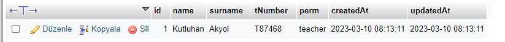
<h2>Öğretmen Login</h2>
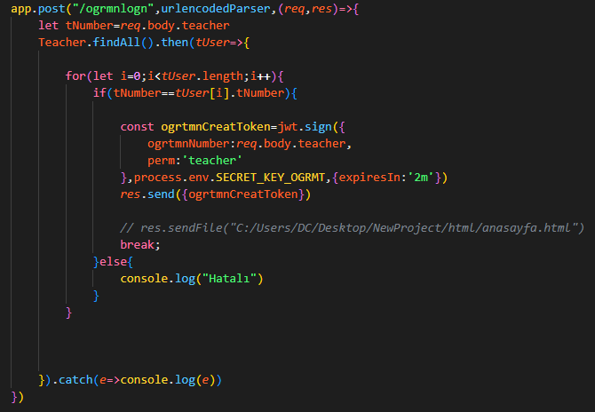
<h2>Öğretmen JsonWebToken</h2>
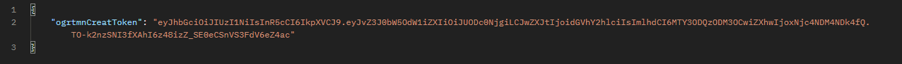
  

<h2>Create Lesson</h2>
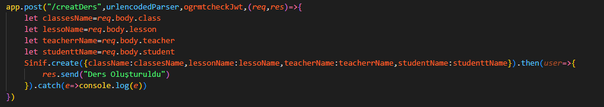
<h2>Lesson DataBase</h2>
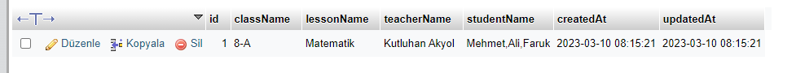
<h2>Lessons</h2>
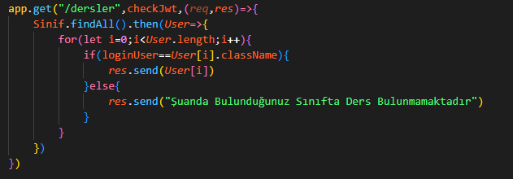

